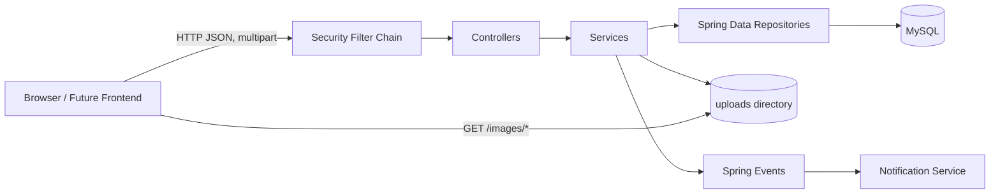

# 아키텍처

## 전체 구조

단일 Spring Boot 애플리케이션 안에서 기능별 패키지를 나누는 계층형 모놀리스다.

## 패키지 책임

| 패키지 | 책임 | 대표 진입점 |
|---|---|---|
| `auth` | 로컬 로그인, refresh token, 현재 사용자 해석 | `AuthController`, `AuthService` |
| `auth.jwt` | bearer token 검증/생성 | `JwtAuthenticationFilter` |
| `auth.oauth`, `auth.oauth2` | Kakao/Google OAuth 연동 | OAuth 컨트롤러·핸들러 |
| `board` | 게시판 CRUD | `BoardController` |
| `post` | 게시글, 이미지, 조회수 | `PostController`, `FileStorageService` |
| `comment` | 댓글/답글, 소프트 삭제 | `CommentController` |
| `reaction` | 좋아요/싫어요 | `PostReactionService` |
| `notification` | 댓글 이벤트 기반 알림 | `NotificationEventListener` |
| `user` | 사용자 프로필 조회 | `UserProfileController` |
| `Global.Entity` | JPA 엔티티 | `User`, `Post`, `Comment` 등 |
| `Global.config` | Security/MVC/외부 클라이언트 설정 | `SecurityConfig`, `WebConfig` |
| `Global.exception` | 오류 코드와 전역 변환 | `GlobalExceptionHandler` |

## 일반 요청 흐름

1. `JwtAuthenticationFilter`가 `Authorization: Bearer <JWT>`를 확인한다.
2. 유효하면 이메일을 subject에서 읽고 `CustomUserDetails`를 SecurityContext에 넣는다.
3. `SecurityConfig`가 공개/인증 경로를 판정한다.
4. 컨트롤러가 `@AuthenticationPrincipal` 또는 `@LoginUserId`로 사용자 ID를 얻는다.
5. 서비스가 JPA 엔티티를 조회/변경하고 DTO로 변환한다.
6. 비즈니스 예외는 `ErrorResponse {code,msg,time}` 형태를 목표로 한다.

## 권한 판정

- 게시글 수정/삭제: `@PreAuthorize("@postSecurity.isAuthor(...)")`
- 댓글 수정/삭제: `@PreAuthorize("@commentSecurity.isAuthor(...)")`
- 게시판 수정/삭제: `hasRole('ADMIN')`
- 게시판 생성: 인증만 필요하며 관리자 검사는 주석 처리됨
- 공개 GET: `/api/board/**`, `/api/post/**`, `/api/comment/**`
- 그 외 API: 기본적으로 인증 필요

## 데이터 조회 특성

- 게시글의 게시판별 목록은 `board`, `user`를 EntityGraph로 로딩한다.
- 댓글 루트 목록은 생성일 오름차순이며 자식도 생성일 오름차순이다.
- 게시글 목록 기본 정렬은 생성일 내림차순, 페이지 크기 10이다.
- 댓글 컨트롤러 기본 정렬은 내림차순을 요청하지만 repository 메서드 이름이 `OrderByCreatedAtAsc`이므로 실제 정렬 의도를 확인해야 한다.
- Spring page 응답은 `VIA_DTO` 모드이며 프론트는 `content`와 `page.number/page.totalPages`를 사용한다.

## 트랜잭션 경계

- 쓰기 서비스 대부분은 `@Transactional`이다.
- 댓글 저장 후 `CommentCreateEvent`가 발행된다.
- 알림 리스너는 원 트랜잭션 커밋 후 새 트랜잭션으로 실행한다. 따라서 알림 실패가 댓글 생성을 롤백하지 않는다.
- `PostReactionService`에는 트랜잭션과 명시적 `save`가 없어 현재 변경이 영속화되지 않는다. 상세는 [[07-known-issues-and-decisions#P0 — 기능을 깨뜨리는 문제]].

## 주요 설계 경계

- API 응답 엔티티 노출 대신 DTO를 사용한다.
- 파일 메타데이터는 DB, 바이너리는 로컬 디스크에 저장한다.
- 알림은 Post/Comment 엔티티 연관 대신 대상 ID를 값으로 저장한다.
- 댓글은 물리 삭제 대신 `deleted=true`와 대체 문구를 사용한다.

