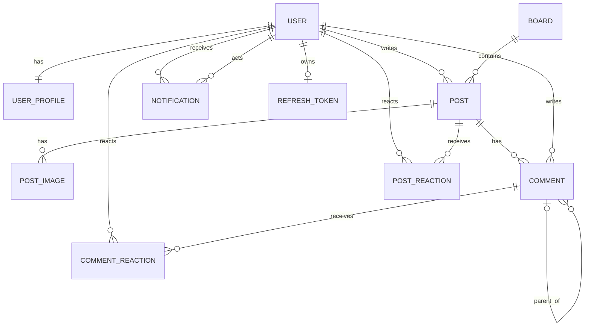

# 도메인 모델

## 관계도

## 엔티티 사전

### User (`Auth` 테이블)

인증 계정이다. `email`은 unique/not null, 비밀번호는 BCrypt 해시, 역할은 `ADMIN | USER | GUEST`다. OAuth 계정은 `provider`, `providerId`, `profileImageUrl`을 추가로 사용한다.

> [!warning] `pw`가 not null이므로 OAuth 사용자 생성 로직에서도 대체 값이 필요하다. OAuth 서비스 변경 시 확인한다.

### UserProfile (`User` 테이블)

계정과 1:1인 선택적 상세 프로필이다. `name`, `sex`, `birth`, `number`, `address`를 보유하지만 현재 API는 name/birth/number/createAt만 반환한다.

### Board (`board`)

`name`과 `description`을 가진 게시판 분류다. 애플리케이션에서 이름 중복을 검사하지만 DB unique 제약은 없다.

### Post (`post`)

게시판과 작성자에 속하며 title/body/viewCount, 정렬된 이미지 목록을 가진다. 작성자가 아닌 사용자가 상세 조회할 때 조회수가 1 증가한다. 비회원도 작성자가 아니므로 증가한다.

### PostImage (`post_image`)

저장 파일명, 원본 파일명, MIME type, size, sortOrder를 보유한다. 응답 URL은 `/images/{storedName}`이다.

### Comment (`commnent` 테이블)

Post와 User에 속하고 self-reference `parent`로 답글을 표현한다. 삭제는 `deleted=true`인 소프트 삭제이며 응답 내용은 `삭제된 댓글입니다.`로 치환된다.

> [!warning] 테이블 이름이 코드상 `commnent`로 오타가 난 상태다. 운영 DB와 마이그레이션 전에 이름을 확정해야 한다.

### PostReaction / CommentReaction

사용자당 대상 하나의 반응만 허용한다. 복합 unique 제약은 각각 `(post_id,user_id)`, `(comment_id,user_id)`다. 타입은 `LIKE | DISLIKE`다. 동일 타입을 다시 누르면 취소한다는 서비스 의도가 있다.

### Notification (`notification`)

수신자, 행위자, 타입, postId, commentId, 읽음 상태를 저장한다. 타입은 `COMMENT_ON_POST | REPLY_ON_COMMENT`다. 자기 글에 직접 댓글하거나 자기 댓글에 답글을 단 경우 알림을 만들지 않는다.

### RefreshToken (`refresh_token`)

사용자당 하나의 opaque UUID refresh token과 만료 시각을 저장한다. 새 로그인 시 기존 행을 갱신하므로 계정별 단일 refresh session 모델이다.

## 핵심 불변조건

- 이메일은 중복될 수 없다.
- 게시글은 반드시 하나의 게시판과 작성자를 가진다.
- 댓글은 반드시 하나의 게시글과 작성자를 가진다.
- 반응은 한 사용자가 한 대상에 최대 하나다.
- 알림은 수신자 본인만 읽음 처리할 수 있다.
- 게시글/댓글 수정·삭제는 작성자만 가능하다.
- 게시판 수정·삭제는 관리자만 가능하다.

## 삭제 의미

| 대상 | 현재 방식 | 연쇄 영향 |
|---|---|---|
| 댓글 | 소프트 삭제 | 답글 구조 유지 |
| 게시글 | 물리 삭제 | 댓글을 먼저 직접 삭제, 이미지는 cascade/orphan removal |
| 게시판 | 물리 삭제 | 각 게시글의 댓글 삭제 후 게시글/게시판 삭제 |
| 사용자 | API 없음 | 연관 삭제 정책 미정 |

알림과 반응까지 수동 삭제되는지는 현재 서비스 코드에서 보장되지 않는다. FK 설정에 따라 게시글/게시판 삭제가 실패할 수 있으므로 [[07-known-issues-and-decisions]]를 참고한다.

