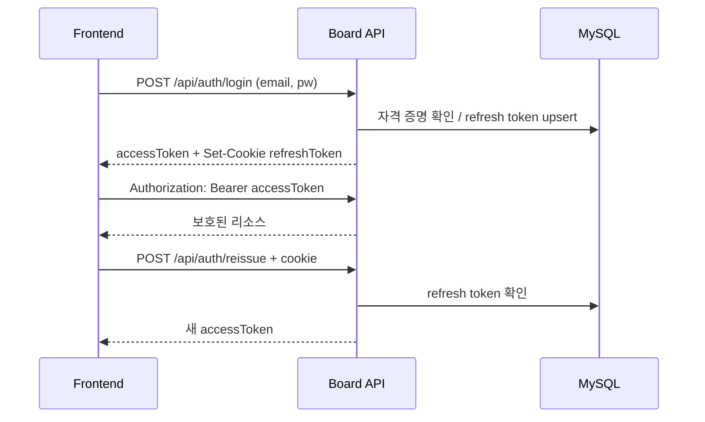

# 인증과 보안

## 세션 모델

서버 세션을 사용하지 않는 JWT + opaque refresh token 구조다.

## 토큰 저장 권고

현재 정적 클라이언트는 access token과 사용자 요약을 `localStorage`에 저장한다. 새 프론트엔드는 다음 중 하나를 명시적으로 결정해야 한다.

- 권고: access token은 메모리, refresh token은 HttpOnly/Secure cookie. 새로고침 때 `/reissue`로 복구.
- 현재 호환: access token을 localStorage에 저장. 구현은 단순하지만 XSS 노출 범위가 커진다.

refresh cookie 현재 설정:

- 이름 `refreshToken`
- HttpOnly
- path `/api/auth`
- SameSite `Strict`
- 개발 환경 `secure=false`
- 유효시간 36,000초

운영 환경에서는 `secure=true`, HTTPS, CORS/동일 출처 전략을 함께 확정한다.

## 프론트엔드 인증 알고리즘

1. 앱 시작 시 `POST /api/auth/reissue`를 cookie 포함해 호출한다.
2. 성공하면 응답 access token에 `Bearer `가 없을 경우 붙여 메모리에 저장한다.
3. 일반 API 401 발생 시 재발급을 한 번만 시도한다.
4. 성공하면 원 요청을 한 번 재시도한다.
5. 재발급 실패 시 인증 상태를 지우고 로그인 화면으로 이동한다.
6. 동시에 여러 401이 발생하면 하나의 재발급 Promise를 공유해 refresh 폭주를 막는다.

## 공개/보호 정책

공개:

- 정적 리소스와 `/images/**`
- `/api/auth/**`, `/api/oauth/**`
- 모든 게시판/게시글/댓글 GET

보호:

- `/api/user/me`
- 쓰기 API 전반
- 반응과 알림 API

메서드 보안:

- 게시글과 댓글 수정/삭제는 서버 작성자 검사를 반드시 통과해야 한다.
- 게시판 수정/삭제는 `ADMIN`만 가능하다.
- UI에서 버튼을 숨기는 것은 편의 기능일 뿐 보안 경계가 아니다.

## OAuth 흐름

Spring Security 표준 흐름은 Google/Kakao를 지원하며 성공 시 refresh cookie를 설정하고 `/`로 redirect한다. access token은 응답 body에 쓰지 않고 redirect하므로 클라이언트는 도착 후 `/api/auth/reissue`로 access token을 얻어야 한다.

별도 `/api/oauth/kakao/*` 구현도 공존한다. 두 Kakao 흐름은 중복되므로 프론트엔드 제작 전에 하나를 표준으로 선택한다.

## 보안상 즉시 조치할 항목

- `application.yaml`의 DB 비밀번호와 JWT secret을 환경 변수로 이동하고 노출된 secret은 교체한다.
- `JwtTokenProvider` 생성 로그에서 secret 출력 제거.
- JWT/refresh token 원문 로그 제거.
- 회원가입 요청에서 클라이언트가 `ADMIN` 역할을 선택할 수 없도록 서버가 기본 `USER`를 강제한다.
- refresh token을 JSON body에서 제거하고 cookie로만 전달할지 결정한다.
- 운영 CORS, cookie domain/SameSite, HTTPS 정책을 정의한다.

관련 문제 목록: [[07-known-issues-and-decisions]].

