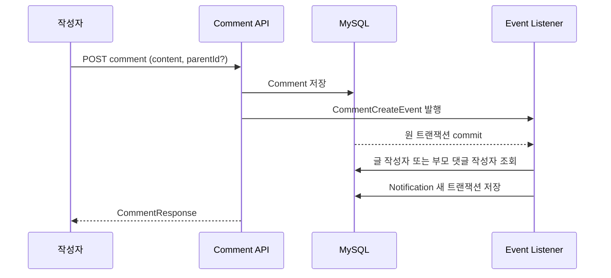

# 기능 흐름

## 게시글 탐색과 조회수

1. `GET /api/board/all`로 게시판을 표시한다.
2. 선택 게시판의 `GET /api/post/{boardId}/all`을 페이지 단위로 읽는다.
3. 글을 선택하면 `GET /api/post/{id}`를 호출한다.
4. 서버는 요청자가 작성자가 아니면 viewCount를 증가시킨다. 비회원도 증가 대상이다.
5. 상세 응답의 `canEdit`, `canDelete`, 반응 집계를 UI에 반영한다.

> [!note] 현재 조회수는 요청마다 증가한다. 사용자/세션/IP별 중복 방지 요구사항은 없다.

## 게시글 작성과 이미지

1. 로그인 사용자가 게시판을 선택한다.
2. title/body와 최대 3개 이미지를 multipart로 전송한다.
3. 서버는 파일 MIME과 확장자를 모두 검사하고 UUID 파일명으로 저장한다.
4. 게시글 DB 저장 실패 시 이번 요청에서 저장한 파일을 삭제한다.
5. 상세 화면은 응답의 `/images/{storedName}` URL을 사용한다.

현재 게시글 수정은 JSON title/body만 받으며 기존 이미지 추가/삭제/재정렬을 지원하지 않는다.

## 댓글과 답글

- `parentId=null`: 게시글의 루트 댓글, 게시글 작성자에게 알림
- `parentId!=null`: 답글, 부모 댓글 작성자에게 알림
- 작성자와 수신자가 같으면 알림 생략
- 삭제는 구조 보존을 위해 내용만 대체하는 소프트 삭제
- API 모델은 재귀 children을 허용하지만 UI/정책상 허용 깊이는 정의되지 않았다

## 반응 토글 의도

| 기존 상태 | 요청 | 목표 결과 |
|---|---|---|
| 없음 | LIKE | LIKE 생성 |
| LIKE | LIKE | 취소(행 삭제 또는 상태 제거) |
| LIKE | DISLIKE | DISLIKE로 전환 |
| DISLIKE | DISLIKE | 취소 |

현재 `PostReactionService`는 `changeType(null)`을 사용할 수 있지만 DB column은 nullable=false이며 저장/삭제 분기가 없다. 목표 구현은 취소 시 행 삭제, 생성/전환 시 저장하는 방식이 가장 명확하다.

## 알림 확인

1. 로그인 후 `/unreads`를 호출해 badge를 갱신한다.
2. 팝업을 열면 최신순 페이지를 읽는다.
3. 알림 선택 시 소유자 검사를 포함한 `/read` 호출 후 postId의 상세로 이동한다.
4. commentId가 있으면 향후 해당 댓글을 강조/스크롤하는 요구사항으로 확장할 수 있다. 현재 정적 UI는 post만 연다.

## 콘텐츠 삭제

- 댓글: 소프트 삭제, 답글 유지
- 글: 댓글을 물리 삭제한 후 글 삭제
- 게시판: 소속 글의 댓글 → 글 → 게시판 순서

반응/알림 참조와 로컬 이미지 실제 파일 제거는 현재 삭제 흐름에서 완전하게 처리되지 않는다.

